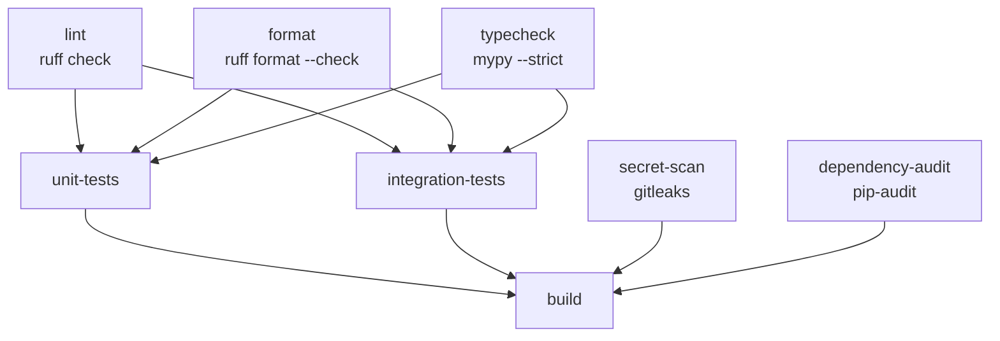

# 038 — CI/CD pipeline design (the pipeline that does not exist)

## Verdict

There is no CI/CD pipeline today: `.github/workflows/scrape.yml` is `workflow_dispatch`-only
(`scrape.yml:6`) and is a *deployment* job, not a quality gate. This document specifies the
pipeline to build from zero — an 8-job GitHub Actions graph (`ci.yml`) with exact numeric
thresholds. The single highest-leverage prerequisite is **not** a workflow edit: it is adding a
`pyproject.toml` + `uv.lock` and typing the record as `BusinessRecord`, because the
typecheck and dependency-audit gates cannot pass against the current untyped, lockless code.

## What exists today (anchored)

- `.github/workflows/scrape.yml` — `on: workflow_dispatch` only, cron commented out
  (`scrape.yml:4-6`); no lint/format/test/type/audit stage of any kind.
- `requirements.txt:1-3` — three direct pins (`requests==2.32.3`, `beautifulsoup4==4.12.3`,
  `lxml==5.2.2`). **No lockfile, no hashes, no transitive pins** (transitives: `urllib3`,
  `certifi`, `charset-normalizer`, `idna`, `soupsieve`).
- **Zero packaging** — no `pyproject.toml`, no `setup.py`, no `[build-system]`. No `tests/`
  directory, no `pytest` config.
- Runtime source: `main.py`, `dedup.py`, `enricher.py`, `pitch_recommender.py`, `scrapers/`.

The new pipeline is a *separate* file, `.github/workflows/ci.yml`. It does not touch
`scrape.yml`; the scheduled scrape remains its own deploy pipeline.

## Job graph



Exact `needs` wiring (8 jobs, 2 parallel tiers + a final gate):

| Job | `runs-on` | `needs` | `timeout-minutes` |
|---|---|---|---|
| `lint` | `ubuntu-latest` | — | 5 |
| `format` | `ubuntu-latest` | — | 5 |
| `typecheck` | `ubuntu-latest` | — | 10 |
| `secret-scan` | `ubuntu-latest` | — | 5 |
| `dependency-audit` | `ubuntu-latest` | — | 10 |
| `unit-tests` | `ubuntu-latest` | `[lint, format, typecheck]` | 15 |
| `integration-tests` | `ubuntu-latest` | `[lint, format, typecheck]` | 20 |
| `build` | `ubuntu-latest` | `[unit-tests, integration-tests, secret-scan, dependency-audit]` | 10 |

Rationale: the five fast static jobs (lint/format/typecheck/secret/audit) run in parallel and
are the cheapest failures. `unit-tests` and `integration-tests` are gated behind the three
code-quality jobs so broken code fails before CI spends minutes running tests. `build` is the
single release gate — it only runs when every other job is green.

## Gates (numeric thresholds)

These are the exact numbers the pipeline enforces. Any one failure fails the whole run.

| # | Gate | Tool | Command | Threshold (fail if…) |
|---|---|---|---|---|
| 1 | Lint | `ruff` | `ruff check .` | any violation; rule set `E F W I UP B SIM S` (≥ 1 = exit 1) |
| 2 | Format | `ruff` | `ruff format --check .` | any file would be reformatted (≥ 1 = exit 1) |
| 3 | Typecheck | `mypy` | `mypy --strict .` | any error (`Success: no issues found` required) |
| 4 | Unit tests + coverage | `pytest` + `pytest-cov` | `pytest tests/unit --cov --cov-fail-under=90` | any test failure, or line coverage < **90%**, or branch < **80%** |
| 5 | Integration tests | `pytest` + `vcrpy` | `pytest tests/integration --block-network` | any failure, or any request not served by a cassette (`record_mode=none`) |
| 6 | Secret scan | `gitleaks` | `gitleaks/gitleaks-action@v2` | any detected leak (exit 0 required) |
| 7 | Dependency audit | `pip-audit` | `pypa/gh-action-pip-audit@v1.1.0` | any known CVE, any severity (exit 0 required) |
| 8 | Build | `uv build` | `uv build` + wheel import smoke test | sdist/wheel not produced, or wheel fails to import |

Coverage is measured over the union of unit + integration runs (via `coverage combine`), so the
90% line / 80% branch number includes the scrapers (covered by cassettes) and `main.py`
(covered by a smoke test). Additionally, the pure-logic modules must individually reach **≥ 95%
line coverage**: `dedup.py`, `scrapers/whitelist.py`, `pitch_recommender.py`, and the pure
functions of `enricher.py` (`infer_region`, `completeness_score`, `lead_score`).

## Job-by-job spec

### `lint` — `ruff check .`
Rule set in `[tool.ruff.lint]` `select = ["E", "F", "W", "I", "UP", "B", "SIM", "S"]`.
`I` (isort) enforces import order; `UP` flags deprecated calls; `S` (flake8-bandit) flags
`verify=False` and other insecure patterns. Gate: **0 violations**.

### `format` — `ruff format --check .`
Line length 88 (default), `target-version = "py312"`. Gate: **0 files differ**. A separate job
(not folded into `lint`) so a formatting-only PR gets a precise failure signal.

### `typecheck` — `mypy --strict .`
`[tool.mypy] strict = true`, `python_version = "3.12"`. `--strict` enables
`disallow_untyped_defs`, `disallow_any_generics`, `warn_return_any`, `no_implicit_optional`,
`warn_unused_ignores`, etc. Gate: **0 errors**. This is the gate that requires the typing
refactor described in the findings below.

### `unit-tests` — `pytest tests/unit --cov --cov-fail-under=90`
Pure logic only, no network: `normalize_phone`/`normalize_name`/`dedup`/`_merge`, whitelist
`is_business_category`/`industry_priority`, `recommend_service` (parametrized over every branch
of the if-chain in `pitch_recommender.py:54-96`), `infer_region`, `completeness_score`,
`lead_score`, and `main.load_master`/`write_csv`/`has_any_contact` against `tmp_path` fixtures.
Gate: 0 failures + coverage thresholds from the table above.

### `integration-tests` — `pytest tests/integration --block-network`
Network paths replayed from committed cassettes (`tests/cassettes/`):
- `OSMScraper.scrape()` against a recorded Overpass `[out:json]` response (`osm.py:40-54`).
- `WikidataScraper.scrape()` against a recorded SPARQL JSON binding set (`wikidata.py:58-69`).
- `GooglePlacesScraper._scrape_query()` against recorded Text Search pages, incl. pagination
  (`google_places.py:203-278`).
- `enricher._fetch_website()` against recorded HTML covering email/instagram/whatsapp/linkedin
  extraction and the blacklist paths (`enricher.py:142-177`).
- `main()` end-to-end with `DATA_DIR` pointed at `tmp_path` and the three scrapers monkeypatched
  to yield recorded fixtures.

VCR is configured `record_mode = "none"` and `--block-network` is passed, so any code path that
tries a live HTTP call fails the job. Gate: **0 failures, zero live requests**.

### `secret-scan` — gitleaks
`gitleaks/gitleaks-action@v2` with `fetch-depth: 0` so the full commit history is scanned, not
just the PR diff. Gate: **0 leaks**. Complements (does not replace) the ruff `S` bandit rules,
which catch `verify=False` where gitleaks is silent.

### `dependency-audit` — pip-audit
Resolve the full transitive tree from the lockfile and audit it:
`uv export --format requirements-txt --no-hashes > requirements.lock` then
`pypa/gh-action-pip-audit@v1.1.0` with `inputs: requirements.lock`. Gate: **0 known CVEs, any
severity**. Re-audits weekly via cron even when no PR changes the deps.

### `build` — `uv build` + wheel import
Add `[build-system]` (`hatchling`) and `[project]` (name `leadminer`, `requires-python >= 3.12`,
deps moved out of `requirements.txt`). Produce `dist/leadminer-*.whl` + sdist, then install the
wheel into a clean env and `python -c "import dedup, enricher, pitch_recommender, scrapers"`.
Gate: build succeeds and the wheel imports cleanly. (Optionally also `docker/build-push-action`
to image the scheduled scrape — but that lives with `scrape.yml`, not here.)

## The workflow file

```yaml
name: CI

on:
  push: { branches: [main] }
  pull_request:
  workflow_dispatch:
  schedule:
    - cron: '30 4 * * 1'   # weekly dependency re-audit (Mon 04:30 UTC)

permissions:
  contents: read

concurrency:
  group: ci-${{ github.ref }}
  cancel-in-progress: true

jobs:
  lint:
    runs-on: ubuntu-latest
    timeout-minutes: 5
    steps:
      - uses: actions/checkout@v4
      - uses: astral-sh/setup-uv@v5
        with: { python-version: '3.12', enable-cache: true }
      - run: uv sync --frozen --all-groups
      - run: uv run ruff check .

  format:
    runs-on: ubuntu-latest
    timeout-minutes: 5
    steps:
      - uses: actions/checkout@v4
      - uses: astral-sh/setup-uv@v5
        with: { python-version: '3.12', enable-cache: true }
      - run: uv sync --frozen --all-groups
      - run: uv run ruff format --check .

  typecheck:
    runs-on: ubuntu-latest
    timeout-minutes: 10
    steps:
      - uses: actions/checkout@v4
      - uses: astral-sh/setup-uv@v5
        with: { python-version: '3.12', enable-cache: true }
      - run: uv sync --frozen --all-groups
      - run: uv run mypy --strict .

  secret-scan:
    runs-on: ubuntu-latest
    timeout-minutes: 5
    steps:
      - uses: actions/checkout@v4
        with: { fetch-depth: 0 }
      - uses: gitleaks/gitleaks-action@v2
        env:
          GITHUB_TOKEN: ${{ secrets.GITHUB_TOKEN }}

  dependency-audit:
    runs-on: ubuntu-latest
    timeout-minutes: 10
    steps:
      - uses: actions/checkout@v4
      - uses: astral-sh/setup-uv@v5
        with: { python-version: '3.12', enable-cache: true }
      - run: uv sync --frozen --all-groups
      - run: uv export --format requirements-txt --no-hashes > requirements.lock
      - uses: pypa/gh-action-pip-audit@v1.1.0
        with:
          inputs: requirements.lock

  unit-tests:
    runs-on: ubuntu-latest
    timeout-minutes: 15
    needs: [lint, format, typecheck]
    steps:
      - uses: actions/checkout@v4
      - uses: astral-sh/setup-uv@v5
        with: { python-version: '3.12', enable-cache: true }
      - run: uv sync --frozen --all-groups
      - run: uv run pytest tests/unit --cov --cov-report=term-missing --cov-fail-under=90

  integration-tests:
    runs-on: ubuntu-latest
    timeout-minutes: 20
    needs: [lint, format, typecheck]
    steps:
      - uses: actions/checkout@v4
      - uses: astral-sh/setup-uv@v5
        with: { python-version: '3.12', enable-cache: true }
      - run: uv sync --frozen --all-groups
      - run: uv run pytest tests/integration --block-network

  build:
    runs-on: ubuntu-latest
    timeout-minutes: 10
    needs: [unit-tests, integration-tests, secret-scan, dependency-audit]
    steps:
      - uses: actions/checkout@v4
      - uses: astral-sh/setup-uv@v5
        with: { python-version: '3.12', enable-cache: true }
      - run: uv sync --frozen --all-groups
      - run: uv build
      - run: |
          uv pip install --system dist/leadminer-*.whl
          python -c "import dedup, enricher, pitch_recommender, scrapers; print('wheel imports OK')"
```

Supporting `pyproject.toml` fragments (also created as part of this work):

```toml
[project]
name = "leadminer"
version = "0.1.0"
requires-python = ">=3.12"
dependencies = ["requests==2.32.3", "beautifulsoup4==4.12.3", "lxml==5.2.2"]

[build-system]
requires = ["hatchling"]
build-backend = "hatchling.build"

[tool.hatch.build.targets.wheel]
packages = ["scrapers"]

[dependency-groups]
dev = ["ruff", "mypy", "pytest", "pytest-cov", "vcrpy", "pytest-recording", "build"]

[tool.ruff]
target-version = "py312"
line-length = 88

[tool.ruff.lint]
select = ["E", "F", "W", "I", "UP", "B", "SIM", "S"]

[tool.mypy]
strict = true
python_version = "3.12"

[tool.coverage.run]
source = ["dedup", "enricher", "main", "pitch_recommender", "scrapers"]
branch = true

[tool.coverage.report]
fail_under = 90
exclude_lines = ["pragma: no cover", 'if __name__ == "__main__":']

[tool.pytest.ini_options]
addopts = "-ra --strict-markers"
markers = ["integration: uses recorded cassettes / network paths"]
```

## What blocks each gate today (findings)

These are the concrete code changes required before the gates go green. Severity is effort/risk
to the pipeline, not data-loss (the pipeline produces no data yet).

### S2 — `load_master` mutates `DictReader` rows into non-string types, defeating strict typing
- **Where:** `main.py:52-70`
- **Breaks:** gate #3 (`mypy --strict`). `csv.DictReader` yields `dict[str, str]`, but the code
  assigns `None` (`main.py:55`), `float` (`:59`), `int` (`:65`) and `bool` (`:69`) into the
  same dict. mypy reports assignment errors on all four. This one function alone fails the
  typecheck gate.
- **Fix:** build a fresh typed `dict` per row and cast to `BusinessRecord` instead of mutating
  `row` in place (also fixes the runtime side effect of `row[k] = None` leaking into caller state).

### S2 — Pure modules operate on bare `dict`, so `--strict` cannot verify record shape
- **Where:** `dedup.py:41,45,64`; `enricher.py:101,180,227,266`; `pitch_recommender.py:25`
- **Breaks:** gate #3. Every function is annotated `record: dict` / `records: list[dict]`, so a
  typo'd key (`record["completenes_score"]`) is invisible to the type checker and only surfaces
  as a silent `None` downstream. `BusinessRecord` (`scrapers/base.py:5-28`) already exists but is
  never imported by the pure modules.
- **Fix:** split the TypedDict into a partial input shape and a full output shape, then annotate
  the pure modules with them. This is the central refactor for the typecheck gate.

### S2 — No lockfile means the dependency-audit gate has no reproducible input
- **Where:** `requirements.txt:1-3`
- **Breaks:** gate #7. `pip-audit` against bare `requirements.txt` resolves transitive deps
  non-reproducibly and cannot pin/hash them. An unpinned `urllib3` or `certifi` CVE is caught only
  if the resolver happens to pull the vulnerable version.
- **Fix:** add `pyproject.toml` + `uv lock`, commit `uv.lock`, and audit the `uv export` output.

### S3 — Lint blockers: unused imports and a deprecated call
- **Where:** `enricher.py:4` (`from urllib.parse import urljoin, urlparse` — neither is used
  anywhere in the file → F401); `osm.py:31` and `wikidata.py:31` (`datetime.datetime.utcnow()`
  → UP017).
- **Breaks:** gate #1. Three one-line fixes.
- **Fix:** drop `urljoin, urlparse`; replace `utcnow()` with `datetime.now(timezone.utc)`.

### S3 — `verify=False` + `disable_warnings` trips the security lint rule
- **Where:** `enricher.py:146` (`verify=False`) and `enricher.py:268`
  (`urllib3.disable_warnings(...)`)
- **Breaks:** gate #1 with the `S` (bandit) rule set (B501 `request_with_no_cert_validation`).
  It is also a real security weakness: website responses are fetched with TLS verification
  disabled, so any MITM can inject content that feeds the email/instagram/whatsapp extraction.
- **Fix:** drop `verify=False` and the `disable_warnings` call; rely on the system cert store.
  (If a specific host genuinely needs it, scope it to a per-host exception with a comment, but
  there is no evidence any host does.)

### S3 — Hardcoded fallback email and a module-level session complicate cassettes and leak an address
- **Where:** `osm.py:35` and `wikidata.py:34` (`os.environ.get("SCRAPER_EMAIL", "voxire.tech@gmail.com")`);
  `enricher.py:124` (module-level `_SESSION = requests.Session()`)
- **Breaks:** gates #5/#6 partially. The committed `voxire.tech@gmail.com` is a real address in
  the User-Agent of every request (not a credential, so gitleaks won't flag it, but it should not
  be in source). The module-level session is created at import time; VCR patches `Session.send`
  on the class so it is still captured, but an import-time session is a footgun for test isolation.
- **Fix:** require `SCRAPER_EMAIL` (no fallback, or a clearly non-identifying placeholder), and
  construct sessions per-call (or inject a transport) so tests can supply a clean session.

### S3 — `DATA_DIR` is a hardcoded module constant, making `main()` untestable
- **Where:** `main.py:40` (`DATA_DIR = pathlib.Path("data")`)
- **Breaks:** gate #4's smoke test and gate #5's end-to-end test. Tests cannot redirect the five
  CSV writes without monkeypatching a module global, and a mis-run would write into the working
  tree's `data/`.
- **Fix:** make `main(data_dir: pathlib.Path = DATA_DIR)` accept a path, and thread it through
  `load_master`/`write_csv` calls.

### S2 — Google Places threads + shared state make cassette replay nondeterministic
- **Where:** `google_places.py:170-188` (`_WORKERS = 5`, shared `seen_ids`/`all_records`)
- **Breaks:** gate #5's reliability. VCR matches by method+URI so replay is *correct*, but the
  5-thread request ordering is nondeterministic, and `seen_lock`/`records_lock` produce
  thread-order-dependent record lists. Flaky under `--block-network`.
- **Fix:** allow injecting the worker count (env `PLACES_WORKERS`, default 5) and run tests at
  `PLACES_WORKERS=1`; assert on record *sets* rather than order in tests.

## Cassette secret hygiene

VCR cassettes are committed, so they must never contain credentials:

- `filter_headers = ["authorization", "x-goog-api-key", "user-agent"]` — strips the Google API
  key header (`google_places.py:151`) from every recorded request.
- `filter_query_parameters = ["key", "api_key", "token"]`.
- Record cassettes with a throwaway/fake `GOOGLE_PLACES_API_KEY` env var, never a real one.
- `record_mode = "none"` in CI (gates #5) and `record_mode = "once"` only when a developer
  intentionally re-records. Add `# noqa`-style ignore for the fake-key line if gitleaks trips on it.

## Not a bug, but worth knowing

- `scrapers/google_places.py:26` does `from enricher import infer_region` — a top-level import
  into a sibling module *above* the package. mypy resolves it fine from the repo root, but it
  makes `scrapers/` not self-contained. Consider moving `infer_region` into a shared
  `geo.py`/`regions.py` module that both import.
- The scheduled scrape (`scrape.yml`) and this CI file share the `3.12` interpreter and `uv`
  toolchain — keep both pinned to the same Python so the wheel built in CI is the same artifact
  the scrape job would run.
- Enable Dependabot (`version-updates` for `pip`/`uv`) in addition to the pip-audit gate: the
  gate *detects* a CVE, Dependabot *opens the fix PR*.

## Recommended order of work

1. Add `pyproject.toml` (project metadata, `[build-system]`, dev dependency group) and generate
   `uv.lock`; migrate the three deps out of `requirements.txt` into `[project.dependencies]`.
2. Run the fast gates first to get a concrete baseline: `ruff check .`, `ruff format .`,
   `mypy --strict .`, `uv build`. Fix the S3 lint items (unused import, `utcnow`, `verify=False`).
3. Do the typing refactor (S2): partial/full `BusinessRecord`, `load_master` rebuild, annotate
   pure modules. Get `mypy --strict` to 0 errors.
4. Write `tests/unit/` for pure logic; hit ≥ 95% line on the pure modules and ≥ 90% overall.
5. Record `tests/cassettes/` with VCR and a fake key; write `tests/integration/`; lock
   `record_mode=none` + `--block-network`.
6. Add `ci.yml` with the exact graph above; wire gitleaks and pip-audit; add Dependabot.
7. Confirm the `build` job's wheel imports, then (optionally) build a container image for
   `scrape.yml` in a separate concern.
